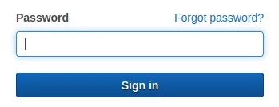

# Activar MFA en tu cuenta AWS

Como medida de seguridad es necesario activar la autenticación multifactor (MFA), en esta pequeña guía veremos los pasos a seguir para su habilitación.

  

## Prerequisito:

Tener instalado Google Authenticator(Mobile) o Authy (Mobile o desktop), en esta guía usaremos Authy Desktop

Ingresar a la consola de AWS Services:

  

Ingresar la contraseña

  

Una vez iniciada la sesión, el campo de búsqueda de servicios escribir IAM

  

Hacer click en el primer resultado

Nos muestra una advertencia en la que se nos sugiere activar MFA para el usuario root.

  

Hacer click en el botón Add MFA, ingresar un nombre para el dispositivo

  

Escoger el tipo de dispositivo, en este caso usaremos Authenticator app, hacer click en Next

  

Hacer click en el texto Show secret key, copiarlo

  

Abrir Authy Desktop, hacer click en el botón +

  

Pegar el código previamente obtenido

  

Hacer click en Add Account, ingresar un nombre para la cuenta, escoger un logotipo acorde al servicio, en este caso Amazon Web Services, hacer click en Save

  

Copiar el código generado por Authy Desktop y pegarlo en la consola de AWS Services

  

Esperar a que genere el segundo código para repetir el anterior paso y hacer click en el botón Add MFA

  

¡Excelente!, cada vez que inicies sesión en tu cuenta tendras que ir a Authy para confirmar la doble autenticación.