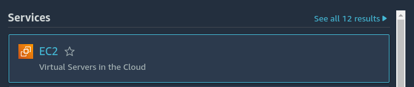
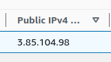

# Crea tu primer carga de trabajo en AWS

## Requisitos

- Cuenta creada en AWS
- Conocimientos en comandos linux básicos

En esta guía vamos a desplegar nuestra primera aplicación web en AWS utilizando el servicio EC2.

> **_NOTA:_** Obviamente hay empresas como DigitalOcean, GoDaddy o el mismo AWS que ofrecen todo esto ya preconfigurado, pero acá lo haremos de esta forma para familiarizarnos con los servicios.


> **_NOTA:_** En guías posteriores utilizaremos Docker para ahorrarnos muchos pasos.

## Creación de Instancia

1. Iniciar sesión en AWS: https://console.aws.amazon.com/console/home?region=us-east-1

2. En la barra de búsqueda ingresar EC2


3. Hacer click en la primera opción



4. Luego, en la parte superior derecha, hacer click en Launch Instance


5. En este caso nombraremos nuestra instancia(servidor) como wordpress


6. Como sistema operativo vámos a utilizar Ubuntu(22.04), si es de su preferencia pueden utilizar Windows, MacOS, Red Hat, Amazon Linux entre otros pero los procedimientos serían distintos.


7. En tipo de instancia vamos a utilizar t2.micro (1 CPU, 1GB).

> **_NOTA:_** Recordar que las cuentas nuevas el primer año incluyen 750 horas gratis para poder utilizar instancias t2.micro con 30GB en espacio.

8. En la sección Key Pair(login) hacer click en Create new key pair, esta llave nos servirá para ingresar a nuestro servidor de forma remota


9. Ingresar un nombre para la llave, en este caso usaremos wordpress, en 'Key pair type' y 'Private key file format' dejar por valores por defecto, al hacer click en Create Key Pair, se descargará la llave wordpress.pem


10. En la sección Network Settings dejar los siguientes valores por defecto, en este caso vamos a utilizar la VPC default que se crea de forma automática al crear la cuenta.


11. En la subsección Firewall dejar seleccionado Create security group

12. En la opción Allow SSH traffic from, hacer click en el recuadro donde dice Anywhere y seleccionar la opción My IP, de esta forma estamos restringiendo el acceso a nuestro servidor por el puerto 22 para que solo pueda ser accedido desde la IP de nuestra casa u oficina.


13. Seleccionar la opción Allow HTTP traffic from the internet (Esto será para habilitar el puerto 80 y poder acceder a nuestra aplicación desde internet)


14. En este tutorial no vamos a habilitar el puerto 443(HTTPS)

15. En la sección Configure Storage colocar 30 gp2 y luego hacer click en Launch Instance

16. Cuando la instancia esté lista se mostrará el siguiente mensaje


17. Hacer click en el id de la Instancia creada 


## Acceder a la instancia

Para acceder a la instancia desde nuestro sistema operativo, en mi caso estoy utilizando Ubuntu, vamos a hacer uso de la llave que hemos creado y descargado

1. Abrir una Terminal(en mi caso estoy usando Terminator), ir al directorio en el cual se encuentra la llave, cambiar permisos de la llave

```
chmod 0400 wordpress.pem
```

2. Desde la consola de AWS donde se creo la instancia, buscamos la columna Public IPv4 Address, copiamos la Ip asignada



3. Iniciar sesión por medio de SSH

```
ssh -i wordpress.pem ubuntu@3.85.104.98
```

En el mensaje que se muestra en la terminal, escribir 'Yes' para aceptar y luego presionar Enter.


Y como dicen los hackers: Estamos dentro!


## Instalar servicios

En esta guía vamos a instalar 4 servicios necesarios para nuestra aplicación:

- MySQL
- Apache
- PHP
- Wordpress

### Instalar MySQL

Para instalar MySQL seguir los siguientes pasos

```
sudo apt-get install mysql-server
```

Escribir 'Y' para aceptar y presionar Enter para iniciar la instalación, este proceso tomará unos segundos.

Para comprobar su instalación, escribir el siguiente comando

```
sudo mysql -u root -p
```

Cuando pida la contraseña presionar Enter, ya que por ahora no se ha configurado ninguna.


Luego escribir exit y presionamos Enter para salir del comando mysql.

Ahora vamos a configurar la seguridad de nuestro servicio MySQL

Ejecutar el siguiente comando:

```
sudo mysql_secure_installation
```


Nos consulta si queremos configurar que se solicite una contraseña cada vez que se quiera acceder al comando mysql, Escribir N para omitir la instalación del componente VALIDATE PASSWORD y luego presionar Enter

Ahora procedemos a escribir la contraseña para nuestro servidor.


Luego de escribir el password e ingresarlo de nuevo, aceptar para poder continuar. Presionamos 'Y' y luego Enter.

Confirmar que queremos borrar los usuarios anónimos, escribir 'Y' y luego enter


En la siguiente captura, deshabilitar la conexión remota


Si se desea remover la base de datos test, presionar 'Y' y luego Enter


Por último presionamos 'Y' y luego Enter.


### Crear Base de Datos

Iniciar sesión en el servicio MySQL

```
sudo mysql -u root -p
```

Ingresar la contraseña cuando se solicita.

Crear un nuevo usuario, en esta ocasión lo nombraremos wordpress dado que estara conectado a nuestro sitio, pero puede llamarse de cualquier manera. En el siguiente comando, cambia el IngresaTuPassword por la contraseña deseada.

```
CREATE USER 'wordpress'@'localhost' IDENTIFIED BY 'IngresaTuPassword';
```

Otorgar todos los permisos al usuario creado

```
GRANT ALL PRIVILEGES ON *.* TO 'wordpress'@'localhost' WITH GRANT OPTION;
```

Crear nuestra base de datos

```
CREATE DATABASE wordpress;
```

Por ultimo escribir exit y presionar Enter para salir del servicio mysql.


### Instalar Apache & PHP

En la Terminal ejecutar el siguiente comando para instalar Apache, php y las dependencias necesarias

```
sudo apt update
sudo apt install apache2 \
                 ghostscript \
                 libapache2-mod-php \
                 mysql-server \
                 php \
                 php-bcmath \
                 php-curl \
                 php-imagick \
                 php-intl \
                 php-json \
                 php-mbstring \
                 php-mysql \
                 php-xml \
                 php-zip
```

### Instalar Wordpress

Crear el directorio en el cual estará alojado nuestro sitio

```
sudo mkdir -p /srv/www
sudo chown www-data: /srv/www
curl https://wordpress.org/latest.tar.gz | sudo -u www-data tar zx -C /srv/www
```

Crear el archivo /etc/apache2/sites-available/wordpress.conf con el siguiente comando

```
nano /etc/apache2/sites-available/wordpress.conf
```

Pegar el siguiente contenido en el archivo, de esta forma le estaremos diciendo a Apache cual es el directorio donde se encuentra nuestro sitio.

```
<VirtualHost *:80>
    DocumentRoot /srv/www/wordpress
    <Directory /srv/www/wordpress>
        Options FollowSymLinks
        AllowOverride Limit Options FileInfo
        DirectoryIndex index.php
        Require all granted
    </Directory>
    <Directory /srv/www/wordpress/wp-content>
        Options FollowSymLinks
        Require all granted
    </Directory>
</VirtualHost>
```

Presionar ctrl + X y luego confirmar presionando 'Y' y luego Enter.

Habilitar el sitio con el siguiente comando

```
sudo a2ensite wordpress
sudo a2enmod rewrite
```

Deshabilitar el sitio default

```
sudo a2dissite 000-default
```

Por ultimo reiniciar el servicio apache

```
sudo service apache2 reload
```

Ahora debemos configurar la base de datos y la contraseña en el sitio wordpress

Cambiar al directorio /srv/www/wordpress/

```
cd /srv/www/wordpress/
```

Crear una copia al archivo wp-config-sample.php con el siguiente comando

```
cp wp-config-sample.php wp-config.php
```

Correr los siguientes comandos, unicamente reemplazar el texto <your-password> por la contrasena que se configuro para el usuario wordpress:


```
sudo -u www-data sed -i 's/database_name_here/wordpress/' /srv/www/wordpress/wp-config.php
sudo -u www-data sed -i 's/username_here/wordpress/' /srv/www/wordpress/wp-config.php
sudo -u www-data sed -i 's/password_here/<your-password>/' /srv/www/wordpress/wp-config.php
```

Editar el nuevo archivo con nano

```
sudo -u www-data nano wp-config.php
```

Posicionate en cada una de estas lineas, y presiona ctrl + K para eliminar cada una de ellas

```
define( 'AUTH_KEY',         'put your unique phrase here' );
define( 'SECURE_AUTH_KEY',  'put your unique phrase here' );
define( 'LOGGED_IN_KEY',    'put your unique phrase here' );
define( 'NONCE_KEY',        'put your unique phrase here' );
define( 'AUTH_SALT',        'put your unique phrase here' );
define( 'SECURE_AUTH_SALT', 'put your unique phrase here' );
define( 'LOGGED_IN_SALT',   'put your unique phrase here' );
define( 'NONCE_SALT',       'put your unique phrase here' );
```

Luego para salir presionas ctrl + x, confirmas con y para guardar los cambios y luego Enter

Luego visitar la IP publica de la instancia, se podra ver la pantalla de configuracion de nuestro website.


> **_NOTA:_** El siguiente paso seria direccionar tu dominio a esta IP y configurar un certificado SSL para poder usar el protocolo HTTPS
