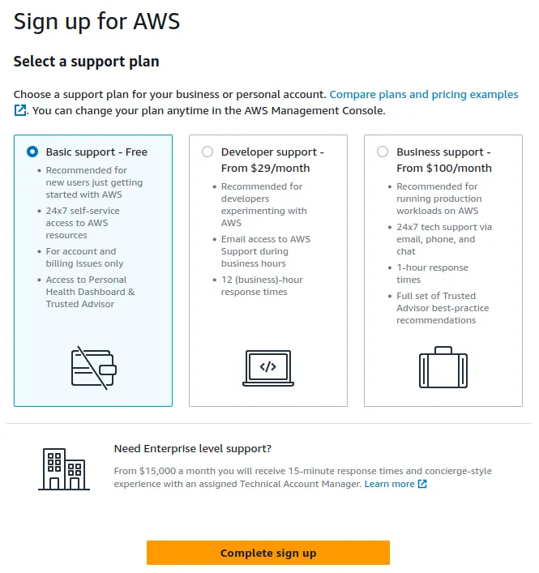

# Como crear una cuenta en AWS Services

El primer paso para migrar hacia la nube con AWS Services es creando una cuenta, en este artículo vamos a crear una cuenta desde cero.

1- El primer paso es ir al sitio web de AWS Service: https://aws.amazon.com/console/

2- En este portal se puede encontrar información acerca de los servicios de AWS, entrenamiento, certificaciones, etc. Por ahora hacer click en el botón ubicado en la parte superior derecha:

  

3- O bien puedes ir directo a este enlace, https://portal.aws.amazon.com/billing/signup#/start/email

4- Ingresa un correo electrónico y el nombre que deseas para tu cuenta

  

6- Hacer click en el botón Verify email address, recibirás un correo con un código de confirmación

7- Copiar y pegar el código, hacer click en el botón Verify

8- Crear una contraseña para tu cuenta

  

9- Llenar el siguiente formulario con tu información personal, no de teléfono, país, dirección, etc al completar hacer click en Continue.

10- Llenar los datos que se solicitan en la parte de facturación

  

11- Notar que en la columna izquierda indican que no se generarán cargos mientras sea dentro de los términos y límites de AWS Free Tier , hacer click en Verify and Continue

  

12- Llenar el formulario para confirmar la identidad

  

13- Confirmar el código enviado por SMS al número registrado

  

14- Por último escoger un plan de soporte, en este caso recomendamos escoger el plan basico(Basic support) el cual no genera ningun cargo, hacer click en Complete sign up

  

Recibiremos la bienvenida a AWS Service, hacer click en el botón Go to the AWS Management Console

  

Ingresar el correo previamente registrado

  

Ingresar la contraseña

  

Felicidades, ya puedes empezar a crear tus aplicaciones y proyectos!

  

Plus: Como medida de seguridad se recomienda activar la autenticación multifactor (MFA), para esto puedes seguir el siguiente enlace.

https://github.com/subgero/tutoriales/tree/main/activar-mfa-cuenta-aws